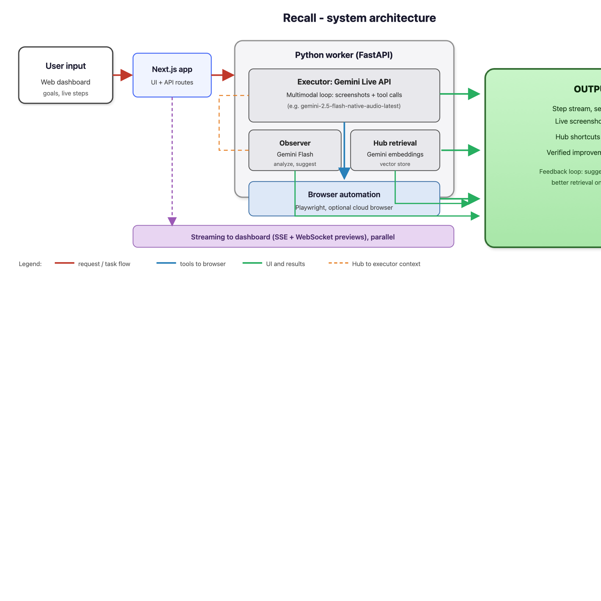

# Recall

Recall is a **self-improving browsing agent**: a Next.js UI sends tasks to a Python worker that controls a real browser (Playwright) using the **Gemini Live API**, while a **Hub** stores and retrieves learned shortcuts with semantic search (ChromaDB + Gemini embeddings).

## Architecture diagram

Flow is similar in spirit to classic Gemini competition submissions: **user input** on the left, **model roles** in the middle, **OUTPUT** on the right, plus a **parallel streaming** band for live UI updates.



*(The Markdown preview in some editors hides `*.svg` images; this PNG is for reliable preview. A vector version is still in [`docs/images/recall-architecture.svg`](docs/images/recall-architecture.svg). On GitHub, either format works.)*

## Which Gemini capability does what?

| Role | API / model style | What it does in Recall |
|------|-------------------|-------------------------|
| **Executor (browser agent)** | **Gemini Live API** (multimodal live session) | Sees **screenshots + your goal**, returns **tool calls** (navigate, click, type, …); the worker runs them in a real browser and loops until done. |
| **Observer (suggestions)** | **Gemini Flash** (standard generate requests) | **Analyzes** runs during / after execution and **proposes** improvements that can be saved to the Hub. |
| **Memory search (Hub)** | **Gemini embeddings** | Turns task text into vectors so the app can **pull relevant shortcuts** from the vector store **before** each run. |
| **Optional focus check** | **Gemini Flash** + image | Sometimes used to **verify** whether the right field is focused after a click (helps with finicky inputs). |

## Privacy and data

- **Screenshots** from the automated browser are sent to **Google’s Gemini APIs** as part of the agent and observer flows. Treat tasks and pages as **sensitive**; do not run against private data you are not allowed to send to a third-party API.
- **API keys** stay on your machines / host env (e.g. `worker/.env`, Vercel env). They are **not** baked into the client.
- The **Hub** stores **shortcut text and metadata** locally under `worker/data/` (vector DB). It is **not** encrypted by this repo; protect the worker host if you deploy.
- **Sessions** are oriented around **your** browser automation runs; this project does not implement enterprise compliance guarantees—use accordingly.

## Third-party APIs and optional services

| Service | Required? | Purpose |
|---------|-------------|---------|
| **Google Gemini API** | **Yes** | Live agent, Flash observers, embeddings. |
| **Browser Use Cloud** (or similar) | **No** | If configured, can provide a **hosted browser** and live view URL; otherwise the worker uses **local Chromium** via Playwright. |
| **Playwright / Chromium** | **Yes** (local path) | Installed via `playwright install chromium` for local automation. |

## Platform notes and gotchas

- **Two processes in dev**: run the **Python worker** and the **Next.js app** separately (`uvicorn` + `npm run dev`). The UI proxies to the worker; one alone is not enough.
- **Python** 3.11+ and **Node** 20+ are assumed; older versions may break.
- **First startup** can be slower while embeddings / vector DB **warm up** (the worker tries a warmup pass on boot).
- **Production**: if the frontend and worker are on **different origins**, configure **CORS** on the worker for your site URL (see deploy section below).
- **WebSockets**: the live preview uses **WS**; ensure your host/proxy allows **WebSocket** upgrades to the worker.

## Authors and contact

- Built for the **Google Gemini** API ecosystem (competition / hackathon submission style).
- **Questions:** open a GitHub issue or reach out via the contact info on your profile.

---

## Repository layout

| Part | Role |
|------|------|
| **`app/`** | Next.js 16 (App Router) — task input, live step feed, session viewer, Hub, SSE proxy to the worker |
| **`worker/`** | FastAPI — Gemini Live agent loop, observers, Hub API, WebSocket screenshot stream |

The browser app calls relative routes such as `/api/run-agent`; those routes proxy to the worker using `WORKER_URL` (server) and expose the UI to the worker via `NEXT_PUBLIC_WORKER_URL` (browser).

## Prerequisites

- **Node.js** 20+ (matches Next.js 16)
- **Python** 3.11+
- **Gemini API key** — [Google AI Studio](https://aistudio.google.com/apikey)

Optional:

- **Browser Use Cloud API key** — remote browser + live preview URL; if unset, the worker uses local headless Chromium.

## 1. Worker (Python)

```bash
cd worker
python3 -m venv venv
source venv/bin/activate   # Windows: venv\Scripts\activate
pip install -r requirements.txt
playwright install chromium
```

Configuration:

```bash
cp .env.example .env
```

Edit `worker/.env`:

| Variable | Required | Description |
|----------|----------|---------------|
| `GEMINI_API_KEY` | **Yes** | Gemini API key |
| `BROWSER_USE_API_KEY` | No | Enables cloud browser session (see Browser Use) |
| `WORKER_PORT` | No | Default `8000` |

ChromaDB persists under `worker/data/chroma/` (created automatically; listed in `worker/.gitignore`).

**Optional:** seed demo shortcuts into the Hub:

```bash
python seed_shortcuts.py
# Reset and reseed:
python seed_shortcuts.py --clear
```

Start the API:

```bash
uvicorn main:app --host 0.0.0.0 --port 8000
# or: uvicorn main:app --host 0.0.0.0 --port ${WORKER_PORT:-8000}
```

Health check: `GET http://127.0.0.1:8000/health`

## 2. Web app (Next.js)

```bash
cd app
npm install
```

Create `app/.env.local` (not committed):

```bash
cp .env.example .env.local
```

Defaults point at `http://127.0.0.1:8000`. Edit if your worker uses another host or port:

```bash
# URL the Next.js server uses when proxying API routes (run-agent, run-ab-test, etc.)
WORKER_URL=http://127.0.0.1:8000

# URL the browser uses for Hub, observer, and WebSocket screenshot stream
NEXT_PUBLIC_WORKER_URL=http://127.0.0.1:8000
```

For **local development**, `http://127.0.0.1:8000` is correct if the worker listens on that host/port.

```bash
npm run dev
```

Open [http://localhost:3000](http://localhost:3000).

## 3. Deploying the frontend (e.g. Vercel)

Deploy the `app/` directory as a Next.js project. Set the same variables in the host’s dashboard:

- `WORKER_URL` — public base URL of your **deployed worker** (must be reachable from Vercel’s servers).
- `NEXT_PUBLIC_WORKER_URL` — same URL, for client-side `fetch` and WebSocket (`ws://` / `wss://` is derived in code).

The worker’s CORS is configured for local Next.js by default. **For production**, add your deployed site origin (e.g. `https://your-app.vercel.app`) to `allow_origins` in `worker/main.py` (or extend the worker to read allowed origins from an environment variable).

## 4. Tests (worker)

With the worker venv activated:

```bash
cd worker
pytest tests/
```

Some tests expect optional dependencies or a running worker; see `worker/tests/` for details.

## API overview (worker)

| Endpoint | Purpose |
|----------|---------|
| `POST /api/run-agent` | Run the agent (SSE) |
| `POST /api/observe` | Real-time observer |
| `POST /api/observe/post-run` | Post-run analysis |
| `GET /api/hub/query` | Shortcuts for a task (used before agent run) |
| `GET /api/hub/shortcuts`, `/stats`, `/search` | Hub data |
| `POST /api/run-ab-test` | A/B baseline vs shortcut (SSE) |
| `WS /ws/screen` | Live screenshot frames |

## License

See repository files for license information if present.
